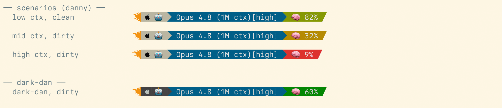
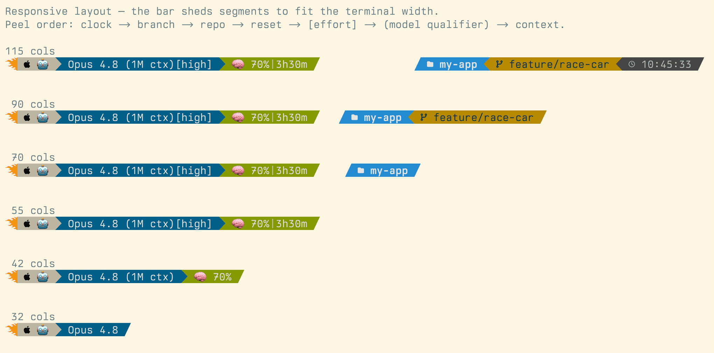
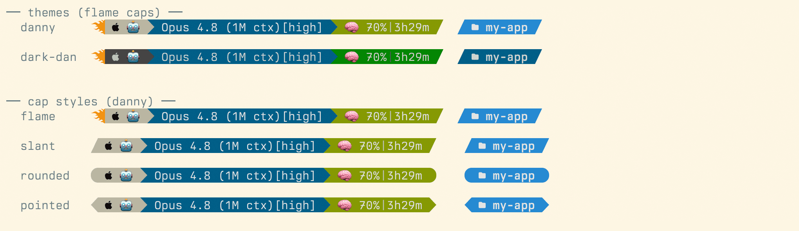

# claude-rocketline

A compact, themeable [Claude Code](https://claude.com/claude-code) status line, styled like a
[Powerlevel10k](https://github.com/romkatv/powerlevel10k) prompt — angled powerline segments, a
context-window meter, git info, and a clock. Built by a designer who cared too much about a
single line in a terminal. 🏎️🔥

## About

I've been a designer for 30 years and a developer for most of them — terminal-first for 25 of those, Powerlevel10k user for the last five. When Claude Code landed I already had strong opinions about what a status line should do. The default felt like a missed opportunity.

So I built one. Named themes, a responsive shed order, a context meter that shifts from green to red as the window fills, and end caps styled like a rocket on a rail. The `danny` and `dark-dan` themes are mine (dial them in with environment variables or swap in your own colors).

This is a designer's take on a developer tool. Opinionated, themeable, and built to stay on one line no matter what.




<sub>(plain-text fallback if the image hasn't loaded:)</sub>

```
🔥 🤖  Opus 4.8 (1M ctx)[high]  🧠 70%|3h30m  /        / my-app  main  09:00:19  /
```

- **Apple + 🤖 badge** — OS icon (auto: macOS/Linux/Windows) paired with the AI
- **Model** — name + reasoning effort, e.g. `Opus 4.8 (1M ctx)[high]`
- **🧠 Context meter** — % of context window remaining, green→yellow→red, with a recessed
  `| 3h30m` 5-hour-limit reset countdown
- **Repo · branch · clock** — right-aligned; repo shows the folder name (no long root path),
  branch is color-coded clean/dirty
- **Remote Control "on-air" light** — while a claude.ai Remote Control session is connected, an
  orange `live` chip joins the right chain; when width tightens, it migrates into the badge as a
  flame-colored broadcast glyph instead of being shed
- **Signature rocket ends** — a flame trailing the left, a slant `/` nosing the right, so the
  line reads like it's moving left→right 🚀

## Responsive layout

The bar is width-aware: as the terminal narrows it **sheds the least-important segments instead of
clipping**, then trims the model label — so it always stays on one line. Peel order:

`clock → live chip (migrates into the badge) → branch → repo → reset countdown → [effort] → (model qualifier) → context chip`



Reproduce it yourself: `bash demos/responsive.sh` (widen to ~115 cols, then screenshot).

## Requirements

- **A [Nerd Font](https://www.nerdfonts.com/)** (e.g. `MesloLGS NF`, the Powerlevel10k default).
  Without one, the powerline separators, flame, apple, branch, and brain glyphs render as tofu (□).
  - You don't have to make a Nerd Font your *primary* terminal font. Any terminal with a
    font-fallback chain (Ghostty, kitty, WezTerm) lets you keep a ligature-rich coding font
    as primary and add a Nerd Font as a **fallback** — the icon codepoints resolve from the
    fallback while your code keeps its ligatures. In Ghostty, just repeat `font-family`:
    ```
    font-family = Your-Coding-Font
    font-family = Symbols Nerd Font Mono
    ```
    [Berkeley Mono](https://usgraphics.com/products/berkeley-mono) pairs especially well in
    this role — it ships specialized coding ligatures (`===`, `++`, `!=`, `->`, `=>`, etc.)
    that carry through unaffected while the Nerd Font fallback supplies the icon codepoints.
    Prefer the **symbols-only** build (`brew install --cask font-symbols-only-nerd-font`) so
    the fallback only supplies icons and never lends a stray Latin glyph. No p10k/statusline
    changes are needed — they just emit the codepoints; the terminal renders them.
- `bash`, `jq`, `git`, and `perl` on `PATH` (perl computes visible string width for the responsive shedding; `install.sh` checks for all four).
- Claude Code (the status line reads its JSON from stdin).

## Install

```bash
git clone https://github.com/dgaidula/claude-rocketline.git
cd claude-rocketline
./install.sh        # copies statusline.sh to ~/.claude/ and prints the settings snippet
```

Or manually: copy `statusline.sh` to `~/.claude/statusline.sh`, `chmod +x` it, and add this to
`~/.claude/settings.json`:

```json
{
  "statusLine": {
    "type": "command",
    "command": "~/.claude/statusline.sh"
  }
}
```

## Themes & options

Set via environment variables in the `command` (they compose):

```json
"command": "STATUSLINE_THEME=dark-dan STATUSLINE_CAPS=rounded ~/.claude/statusline.sh"
```

| Variable | Values | Default | What it does |
|---|---|---|---|
| `STATUSLINE_THEME` | `danny` · `dark-dan` | `danny` | Light signature theme vs. true-dark variant |
| `STATUSLINE_CAPS` | `flame` · `slant` · `rounded` · `pointed` | `flame` | End-cap style |
| `STATUSLINE_OS_ICON` | any glyph | auto | Override the OS badge icon |
| `STATUSLINE_AI_ICON` | any glyph/emoji | `🤖` | Override the AI badge glyph (e.g. set per-launcher to flag which model/persona is running) |
| `STATUSLINE_CTX_ICON` | any glyph/emoji | `🧠` | Context-meter icon |
| `STATUSLINE_PIPE` | 256-color code | `250`/`240` | The `|` separator color |
| `STATUSLINE_FLAME` | hex `F2920D` / 256-num | auto | Flame accent — auto true-color on truecolor terminals (`COLORTERM`), else 256-color `208` |
| `STATUSLINE_BLUE` | 256-color code | theme | Model + repo segment color |
| `STATUSLINE_NEUTRAL` / `_FG` | 256-color code | theme | Grey badge/clock bg / text |
| `STATUSLINE_BADGE_BG/_FG`, `STATUSLINE_TIME_BG/_FG` | 256-color | theme | Per-segment fine control |
| `STATUSLINE_LCAP` / `_RCAP` | glyph(+ANSI) | theme | Raw end-cap override |
| `STATUSLINE_RC` | `1` | unset | Force the Remote Control indicator on (demos/testing) |
| `STATUSLINE_RC_STYLE` | `auto` · `segment` · `badge` | `auto` | `auto` shows the `live` chip while it fits, then migrates it into the badge; `segment`/`badge` force one form |
| `STATUSLINE_RC_ICON` | any glyph | broadcast | Remote Control indicator icon |

### Themes
- **`danny`** — light badge leading, a `238`-grey clock anchoring the right, teal-blue model/repo,
  orange-flame accent.
- **`dark-dan`** — true dark: dim grey neutrals, teal-blue model/repo, muted context colors, with
  the flame as the one bright accent.



<sub>(plain-text fallback — run `bash demos/showcase.sh` to see it live)</sub>

## Demos

```bash
bash demos/preview.sh     # the line across several scenarios
bash demos/showcase.sh    # every theme × cap style
```

## Notes / caveats

- **Right-alignment** needs a terminal width. The script tries Claude Code's
  `terminal.width`/`cols`, then `$COLUMNS`, then `tput cols`, then falls back to `100`.
- **The reset countdown** only appears when Claude Code provides
  `rate_limits.five_hour.resets_at`; it degrades gracefully when absent.
- **The Remote Control indicator is dormant for now.** It's wired to `remote.session_id`, a field
  that exists in Claude Code's status-line payload builder — but as of 2.1.232, verified live with
  a Remote Control session connected, that field is *not* emitted for local RC sessions, and the
  CLI exposes no other signal (no env var, state file, hook, or status command — see
  [anthropics/claude-code#31840](https://github.com/anthropics/claude-code/issues/31840)). The day
  Claude Code ships the signal, the indicator lights up on its own; until then, preview it with
  `STATUSLINE_RC=1`.
- The script defensively `unset`s `GIT_DIR`/`GIT_WORK_TREE` (some shells export `GIT_DIR=./.git`,
  which breaks `git -C` in subdirectories).

## License

MIT — see [LICENSE](LICENSE).
